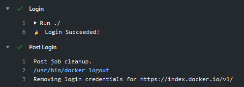

[](https://github.com/crazy-max/ghaction-docker-login/releases/latest)
[](https://github.com/marketplace/actions/docker-login)
[](https://github.com/crazy-max/ghaction-docker-login/actions?workflow=ci)
[](https://github.com/sponsors/crazy-max)
[](https://www.paypal.me/crazyws)

## About

GitHub Action to login against a Docker registry

If you are interested, [check out](https://git.io/Je09Y) my other :octocat: GitHub Actions!



___

* [Usage](#usage)
  * [DockerHub](#dockerhub)
  * [GitHub Package Registry](#github-package-registry)
  * [GitLab](#gitlab)
  * [Google Container Registry (GCR)](#gitlab)
  * [AWS Elastic Container Registry (ECR)](#gitlab)
* [Customizing](#customizing)
  * [inputs](#inputs)
* [Keep up-to-date with GitHub Dependabot](#keep-up-to-date-with-github-dependabot)
* [Limitation](#limitation)
* [How can I help?](#how-can-i-help)
* [License](#license)

## Usage

### DockerHub

```yaml
name: ci

on:
  push:
    branches: master

jobs:
  login:
    runs-on: ubuntu-latest
    steps:
      -
        name: Checkout
        uses: actions/checkout@v2
      -
        name: Login to DockerHub
        uses: crazy-max/ghaction-docker-login@v1
        with:
          username: ${{ secrets.DOCKERHUB_USERNAME }}
          password: ${{ secrets.DOCKERHUB_PASSWORD }}
```

### GitHub Package Registry

```yaml
name: ci

on:
  push:
    branches: master

jobs:
  login:
    runs-on: ubuntu-latest
    steps:
      -
        name: Checkout
        uses: actions/checkout@v2
      -
        name: Login to GitHub Package Registry
        uses: crazy-max/ghaction-docker-login@v1
        with:
          registry: docker.pkg.github.com
          username: ${{ github.repository_owner }}
          password: ${{ secrets.GITHUB_TOKEN }}
```

### GitLab

```yaml
name: ci

on:
  push:
    branches: master

jobs:
  login:
    runs-on: ubuntu-latest
    steps:
      -
        name: Checkout
        uses: actions/checkout@v2
      -
        name: Login to GitLab
        uses: crazy-max/ghaction-docker-login@v1
        with:
          registry: registry.gitlab.com
          username: ${{ secrets.GITLAB_USERNAME }}
          password: ${{ secrets.GITLAB_PASSWORD }}
```

### Google Container Registry (GCR)

Use a service account with the ability to push to GCR and [configure access control](https://cloud.google.com/container-registry/docs/access-control).
Then create and download the JSON key for this service account and save content of `.json` file
[as a secret](https://docs.github.com/en/actions/configuring-and-managing-workflows/creating-and-storing-encrypted-secrets#creating-encrypted-secrets-for-a-repository)
called `GCR_JSON_KEY` in your GitHub repo. Ensure you set the username to `_json_key`.

```yaml
name: ci

on:
  push:
    branches: master

jobs:
  login:
    runs-on: ubuntu-latest
    steps:
      -
        name: Checkout
        uses: actions/checkout@v2
      -
        name: Login to GCR
        uses: crazy-max/ghaction-docker-login@v1
        with:
          registry: gcr.io
          username: _json_key
          password: ${{ secrets.GCR_JSON_KEY }}
```

### AWS Elastic Container Registry (ECR)

Use an IAM user with the [ability to push to ECR](https://docs.aws.amazon.com/AmazonECR/latest/userguide/ecr_managed_policies.html).
Then create and download access keys and save `AWS_ACCESS_KEY_ID` and `AWS_SECRET_ACCESS_KEY` [as secrets](https://docs.github.com/en/actions/configuring-and-managing-workflows/creating-and-storing-encrypted-secrets#creating-encrypted-secrets-for-a-repository)
in your GitHub repo.

```yaml
name: ci

on:
  push:
    branches: master

jobs:
  login:
    runs-on: ubuntu-latest
    steps:
      -
        name: Checkout
        uses: actions/checkout@v2
      -
        name: Login to ECR
        uses: crazy-max/ghaction-docker-login@v1
        with:
          registry: <aws-account-number>.dkr.ecr.<region>.amazonaws.com
          username: ${{ secrets.AWS_ACCESS_KEY_ID }}
          password: ${{ secrets.AWS_SECRET_ACCESS_KEY }}
```

> Replace `<aws-account-number>` and `<region>` with their respective values.

## Customizing

### inputs

Following inputs can be used as `step.with` keys

| Name             | Type    | Default                     | Description                        |
|------------------|---------|-----------------------------|------------------------------------|
| `registry`       | String  |                             | Server address of Docker registry. If not set then will default to Docker Hub |
| `username`       | String  |                             | Username used to log against the Docker registry |
| `password`       | String  |                             | Password or personal access token used to log against the Docker registry |
| `logout`         | Bool    | `true`                      | Log out from the Docker registry at the end of a job |

## Keep up-to-date with GitHub Dependabot

Since [Dependabot](https://docs.github.com/en/github/administering-a-repository/keeping-your-actions-up-to-date-with-github-dependabot)
has [native GitHub Actions support](https://docs.github.com/en/github/administering-a-repository/configuration-options-for-dependency-updates#package-ecosystem),
to enable it on your GitHub repo all you need to do is add the `.github/dependabot.yml` file:

```yaml
version: 2
updates:
  # Maintain dependencies for GitHub Actions
  - package-ecosystem: "github-actions"
    directory: "/"
    schedule:
      interval: "daily"
```

## Limitation

This action is only available for Linux [virtual environments](https://help.github.com/en/articles/virtual-environments-for-github-actions#supported-virtual-environments-and-hardware-resources).

## How can I help?

All kinds of contributions are welcome :raised_hands:! The most basic way to show your support is to star :star2:
the project, or to raise issues :speech_balloon: You can also support this project by
[**becoming a sponsor on GitHub**](https://github.com/sponsors/crazy-max) :clap: or by making a
[Paypal donation](https://www.paypal.me/crazyws) to ensure this journey continues indefinitely! :rocket:

Thanks again for your support, it is much appreciated! :pray:

## License

MIT. See `LICENSE` for more details.
