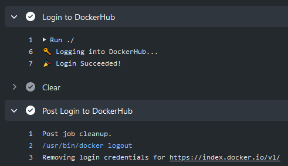

[](https://github.com/docker/login-action/releases/latest)
[](https://github.com/marketplace/actions/docker-login)
[](https://github.com/docker/login-action/actions?workflow=ci)
[](https://github.com/docker/login-action/actions?workflow=test)
[](https://codecov.io/gh/docker/login-action)

## About

GitHub Action to login against a Docker registry.



___

* [Usage](#usage)
  * [Docker Hub](#docker-hub)
  * [GitHub Container Registry](#github-container-registry)
  * [GitLab](#gitlab)
  * [Azure Container Registry (ACR)](#azure-container-registry-acr)
  * [Google Container Registry (GCR)](#google-container-registry-gcr)
  * [Google Artifact Registry (GAR)](#google-artifact-registry-gar)
  * [AWS Elastic Container Registry (ECR)](#aws-elastic-container-registry-ecr)
  * [AWS Public Elastic Container Registry (ECR)](#aws-public-elastic-container-registry-ecr)
  * [OCI Oracle Cloud Infrastructure Registry (OCIR)](#oci-oracle-cloud-infrastructure-registry-ocir)
  * [Quay.io](#quayio)
  * [DigitalOcean](#digitalocean-container-registry)
* [Customizing](#customizing)
  * [inputs](#inputs)
* [Contributing](#contributing)

## Usage

### Docker Hub

When authenticating to [Docker Hub](https://hub.docker.com) with GitHub Actions,
use a [personal access token](https://docs.docker.com/docker-hub/access-tokens/).
Don't use your account password.

```yaml
name: ci

on:
  push:
    branches: main

jobs:
  login:
    runs-on: ubuntu-latest
    steps:
      -
        name: Login to Docker Hub
        uses: docker/login-action@v3
        with:
          username: ${{ vars.DOCKERHUB_USERNAME }}
          password: ${{ secrets.DOCKERHUB_TOKEN }}
```

### GitHub Container Registry

To authenticate to the [GitHub Container Registry](https://docs.github.com/en/packages/working-with-a-github-packages-registry/working-with-the-container-registry),
use the [`GITHUB_TOKEN`](https://docs.github.com/en/actions/reference/authentication-in-a-workflow)
secret.

```yaml
name: ci

on:
  push:
    branches: main

jobs:
  login:
    runs-on: ubuntu-latest
    steps:
      -
        name: Login to GitHub Container Registry
        uses: docker/login-action@v3
        with:
          registry: ghcr.io
          username: ${{ github.actor }}
          password: ${{ secrets.GITHUB_TOKEN }}
```

You may need to [manage write and read access of GitHub Actions](https://docs.github.com/en/packages/managing-github-packages-using-github-actions-workflows/publishing-and-installing-a-package-with-github-actions#upgrading-a-workflow-that-accesses-ghcrio)
for repositories in the container settings.

You can also use a [personal access token (PAT)](https://docs.github.com/en/github/authenticating-to-github/creating-a-personal-access-token)
with the [appropriate scopes](https://docs.github.com/en/packages/getting-started-with-github-container-registry/migrating-to-github-container-registry-for-docker-images#authenticating-with-the-container-registry).

### GitLab

```yaml
name: ci

on:
  push:
    branches: main

jobs:
  login:
    runs-on: ubuntu-latest
    steps:
      -
        name: Login to GitLab
        uses: docker/login-action@v3
        with:
          registry: registry.gitlab.com
          username: ${{ vars.GITLAB_USERNAME }}
          password: ${{ secrets.GITLAB_PASSWORD }}
```

If you have [Two-Factor Authentication](https://gitlab.com/help/user/profile/account/two_factor_authentication)
enabled, use a [Personal Access Token](https://gitlab.com/help/user/profile/personal_access_tokens)
instead of a password.

### Azure Container Registry (ACR)

[Create a service principal](https://docs.microsoft.com/en-us/azure/container-registry/container-registry-auth-service-principal#create-a-service-principal)
with access to your container registry through the [Azure CLI](https://docs.microsoft.com/en-us/cli/azure/install-azure-cli)
and take note of the generated service principal's ID (also called _client ID_)
and password (also called _client secret_).

```yaml
name: ci

on:
  push:
    branches: main

jobs:
  login:
    runs-on: ubuntu-latest
    steps:
      -
        name: Login to ACR
        uses: docker/login-action@v3
        with:
          registry: <registry-name>.azurecr.io
          username: ${{ vars.AZURE_CLIENT_ID }}
          password: ${{ secrets.AZURE_CLIENT_SECRET }}
```

> Replace `<registry-name>` with the name of your registry.

### Google Container Registry (GCR)

> [Google Artifact Registry](#google-artifact-registry-gar) is the evolution of
> Google Container Registry. As a fully-managed service with support for both
> container images and non-container artifacts. If you currently use Google
> Container Registry, use the information [on this page](https://cloud.google.com/artifact-registry/docs/transition/transition-from-gcr)
> to learn about transitioning to Google Artifact Registry. 

You can authenticate with workload identity federation or a service account.

#### Workload identity federation

Configure the workload identity federation for GitHub Actions in Google Cloud,
[see here](https://github.com/google-github-actions/auth#setting-up-workload-identity-federation).
Your service account must have permission to push to GCR. Use the
`google-github-actions/auth` action to authenticate using workload identity as
shown in the following example:

```yaml
name: ci

on:
  push:
    branches: main

jobs:
  login:
    runs-on: ubuntu-latest
    steps:
    -
      name: Authenticate to Google Cloud
      id: auth
      uses: google-github-actions/auth@v1
      with:
        token_format: access_token
        workload_identity_provider: <workload_identity_provider>
        service_account: <service_account>
    -
      name: Login to GCR
      uses: docker/login-action@v3
      with:
        registry: gcr.io
        username: oauth2accesstoken
        password: ${{ steps.auth.outputs.access_token }}
```

> Replace `<workload_identity_provider>` with configured workload identity
> provider. For steps to configure, [see here](https://github.com/google-github-actions/auth#setting-up-workload-identity-federation).

> Replace `<service_account>` with configured service account in workload
> identity provider which has access to push to GCR

#### Service account based authentication

Use a service account with permission to push to GCR and [configure access control](https://cloud.google.com/container-registry/docs/access-control).
Download the key for the service account as a JSON file. Save the contents of
the file [as a secret](https://docs.github.com/en/actions/configuring-and-managing-workflows/creating-and-storing-encrypted-secrets#creating-encrypted-secrets-for-a-repository)
named `GCR_JSON_KEY` in your GitHub repository. Set the username to `_json_key`.

```yaml
name: ci

on:
  push:
    branches: main

jobs:
  login:
    runs-on: ubuntu-latest
    steps:
      -
        name: Login to GCR
        uses: docker/login-action@v3
        with:
          registry: gcr.io
          username: _json_key
          password: ${{ secrets.GCR_JSON_KEY }}
```

### Google Artifact Registry (GAR)

You can authenticate with workload identity federation or a service account.

#### Workload identity federation

Your service account must have permission to push to GAR. Use the
`google-github-actions/auth` action to authenticate using workload identity as
shown in the following example:

```yaml
name: ci

on:
  push:
    branches: main

jobs:
  login:
    runs-on: ubuntu-latest
    steps:
      -
        name: Authenticate to Google Cloud
        id: auth
        uses: google-github-actions/auth@v1
        with:
          token_format: access_token
          workload_identity_provider: <workload_identity_provider>
          service_account: <service_account>
      -
        name: Login to GAR
        uses: docker/login-action@v3
        with:
          registry: <location>-docker.pkg.dev
          username: oauth2accesstoken
          password: ${{ steps.auth.outputs.access_token }}
```

> Replace `<workload_identity_provider>` with configured workload identity
> provider

> Replace `<service_account>` with configured service account in workload
> identity provider which has access to push to GCR

> Replace `<location>` with the regional or multi-regional [location](https://cloud.google.com/artifact-registry/docs/repo-organize#locations)
> of the repository where the image is stored.

#### Service account based authentication

Use a service account with permission to push to GAR and [configure access control](https://cloud.google.com/artifact-registry/docs/access-control).
Download the key for the service account as a JSON file. Save the contents of
the file [as a secret](https://docs.github.com/en/actions/configuring-and-managing-workflows/creating-and-storing-encrypted-secrets#creating-encrypted-secrets-for-a-repository)
named `GAR_JSON_KEY` in your GitHub repository. Set the username to `_json_key`,
or `_json_key_base64` if you use a base64-encoded key.

```yaml
name: ci

on:
  push:
    branches: main

jobs:
  login:
    runs-on: ubuntu-latest
    steps:
      -
        name: Login to GAR
        uses: docker/login-action@v3
        with:
          registry: <location>-docker.pkg.dev
          username: _json_key
          password: ${{ secrets.GAR_JSON_KEY }}
```

> Replace `<location>` with the regional or multi-regional [location](https://cloud.google.com/artifact-registry/docs/repo-organize#locations)
> of the repository where the image is stored.

### AWS Elastic Container Registry (ECR)

Use an IAM user with the ability to [push to ECR with `AmazonEC2ContainerRegistryPowerUser` managed policy for example](https://docs.aws.amazon.com/AmazonECR/latest/userguide/security-iam-awsmanpol.html#security-iam-awsmanpol-AmazonEC2ContainerRegistryPowerUser).
Download the access keys and save them as `AWS_ACCESS_KEY_ID` and `AWS_SECRET_ACCESS_KEY` [as secrets](https://docs.github.com/en/actions/configuring-and-managing-workflows/creating-and-storing-encrypted-secrets#creating-encrypted-secrets-for-a-repository)
in your GitHub repo.

```yaml
name: ci

on:
  push:
    branches: main

jobs:
  login:
    runs-on: ubuntu-latest
    steps:
      -
        name: Login to ECR
        uses: docker/login-action@v3
        with:
          registry: <aws-account-number>.dkr.ecr.<region>.amazonaws.com
          username: ${{ vars.AWS_ACCESS_KEY_ID }}
          password: ${{ secrets.AWS_SECRET_ACCESS_KEY }}
```

If you need to log in to Amazon ECR registries associated with other accounts,
you can use the `AWS_ACCOUNT_IDS` environment variable:

```yaml
name: ci

on:
  push:
    branches: main

jobs:
  login:
    runs-on: ubuntu-latest
    steps:
      -
        name: Login to ECR
        uses: docker/login-action@v3
        with:
          registry: <aws-account-number>.dkr.ecr.<region>.amazonaws.com
          username: ${{ vars.AWS_ACCESS_KEY_ID }}
          password: ${{ secrets.AWS_SECRET_ACCESS_KEY }}
        env:
          AWS_ACCOUNT_IDS: 012345678910,023456789012
```

> Only available with [AWS CLI version 1](https://docs.aws.amazon.com/cli/latest/reference/ecr/get-login.html)

You can also use the [Configure AWS Credentials](https://github.com/aws-actions/configure-aws-credentials)
action in combination with this action:

```yaml
name: ci

on:
  push:
    branches: main

jobs:
  login:
    runs-on: ubuntu-latest
    steps:
      -
        name: Configure AWS Credentials
        uses: aws-actions/configure-aws-credentials@v4
        with:
          aws-access-key-id: ${{ vars.AWS_ACCESS_KEY_ID }}
          aws-secret-access-key: ${{ secrets.AWS_SECRET_ACCESS_KEY }}
          aws-region: <region>
      -
        name: Login to ECR
        uses: docker/login-action@v3
        with:
          registry: <aws-account-number>.dkr.ecr.<region>.amazonaws.com
```

> Replace `<aws-account-number>` and `<region>` with their respective values.

### AWS Public Elastic Container Registry (ECR)

Use an IAM user with permission to push to ECR Public, for example using [managed policies](https://docs.aws.amazon.com/AmazonECR/latest/userguide/security-iam-awsmanpol.html#security-iam-awsmanpol-AmazonEC2ContainerRegistryPowerUser).
Download the access keys and save them as `AWS_ACCESS_KEY_ID` and
`AWS_SECRET_ACCESS_KEY` [secrets](https://docs.github.com/en/actions/configuring-and-managing-workflows/creating-and-storing-encrypted-secrets#creating-encrypted-secrets-for-a-repository)
in your GitHub repository.

```yaml
name: ci

on:
  push:
    branches: main

jobs:
  login:
    runs-on: ubuntu-latest
    steps:
      -
        name: Login to Public ECR
        uses: docker/login-action@v3
        with:
          registry: public.ecr.aws
          username: ${{ vars.AWS_ACCESS_KEY_ID }}
          password: ${{ secrets.AWS_SECRET_ACCESS_KEY }}
        env:
          AWS_REGION: <region>
```

> Replace `<region>` with its respective value (default `us-east-1`).

### OCI Oracle Cloud Infrastructure Registry (OCIR)

To push into OCIR in specific tenancy the [username](https://www.oracle.com/webfolder/technetwork/tutorials/obe/oci/registry/index.html#LogintoOracleCloudInfrastructureRegistryfromtheDockerCLI)
must be placed in format `<tenancy>/<username>` (in case of federated tenancy use the format
`<tenancy-namespace>/oracleidentitycloudservice/<username>`).

For password [create an auth token](https://www.oracle.com/webfolder/technetwork/tutorials/obe/oci/registry/index.html#GetanAuthToken).
Save username and token [as a secrets](https://docs.github.com/en/actions/configuring-and-managing-workflows/creating-and-storing-encrypted-secrets#creating-encrypted-secrets-for-a-repository)
in your GitHub repo. 

```yaml
name: ci

on:
  push:
    branches: main

jobs:
  login:
    runs-on: ubuntu-latest
    steps:
      -
        name: Login to OCIR
        uses: docker/login-action@v3
        with:
          registry: <region>.ocir.io
          username: ${{ vars.OCI_USERNAME }}
          password: ${{ secrets.OCI_TOKEN }}
```

> Replace `<region>` with their respective values from [availability regions](https://docs.cloud.oracle.com/iaas/Content/Registry/Concepts/registryprerequisites.htm#Availab)

### Quay.io

Use a [Robot account](https://docs.quay.io/glossary/robot-accounts.html) with
permission to push to a Quay.io repository.

```yaml
name: ci

on:
  push:
    branches: main

jobs:
  login:
    runs-on: ubuntu-latest
    steps:
      -
        name: Login to Quay.io
        uses: docker/login-action@v3
        with:
          registry: quay.io
          username: ${{ vars.QUAY_USERNAME }}
          password: ${{ secrets.QUAY_ROBOT_TOKEN }}
```

### DigitalOcean Container Registry

Use your DigitalOcean registered email address and an API access token to authenticate.

```yaml
name: ci

on:
  push:
    branches: main

jobs:
  login:
    runs-on: ubuntu-latest
    steps:
      -
        name: Login to DigitalOcean Container Registry
        uses: docker/login-action@v3
        with:
          registry: registry.digitalocean.com
          username: ${{ vars.DIGITALOCEAN_USERNAME }}
          password: ${{ secrets.DIGITALOCEAN_ACCESS_TOKEN }}
```

## Customizing

### inputs

The following inputs can be used as `step.with` keys:

| Name       | Type   | Default | Description                                                                   |
|------------|--------|---------|-------------------------------------------------------------------------------|
| `registry` | String |         | Server address of Docker registry. If not set then will default to Docker Hub |
| `username` | String |         | Username for authenticating to the Docker registry                            |
| `password` | String |         | Password or personal access token for authenticating the Docker registry      |
| `ecr`      | String | `auto`  | Specifies whether the given registry is ECR (`auto`, `true` or `false`)       |
| `logout`   | Bool   | `true`  | Log out from the Docker registry at the end of a job                          |

## Contributing

Want to contribute? Awesome! You can find information about contributing to
this project in the [CONTRIBUTING.md](/.github/CONTRIBUTING.md)
