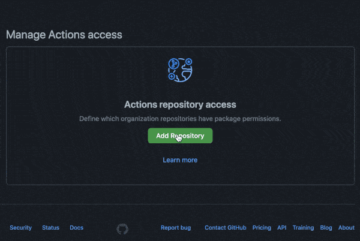

[](https://github.com/docker/login-action/releases/latest)
[](https://github.com/marketplace/actions/docker-login)
[](https://github.com/docker/login-action/actions?workflow=ci)
[](https://github.com/docker/login-action/actions?workflow=test)
[](https://codecov.io/gh/docker/login-action)

## About

GitHub Action to login against a Docker registry.

> :bulb: See also:
> * [setup-buildx](https://github.com/docker/setup-buildx-action) action
> * [setup-qemu](https://github.com/docker/setup-qemu-action) action
> * [build-push](https://github.com/docker/build-push-action) action


___

* [Usage](#usage)
  * [Docker Hub](#docker-hub)
  * [GitHub Packages Docker Registry](#github-packages-docker-registry)
  * [GitHub Container Registry](#github-container-registry)
  * [GitLab](#gitlab)
  * [Azure Container Registry (ACR)](#azure-container-registry-acr)
  * [Google Container Registry (GCR)](#google-container-registry-gcr)
  * [Google Artifact Registry (GAR)](#google-artifact-registry-gar)
  * [AWS Elastic Container Registry (ECR)](#aws-elastic-container-registry-ecr)
  * [AWS Public Elastic Container Registry (ECR)](#aws-public-elastic-container-registry-ecr)
  * [OCI Oracle Cloud Infrastructure Registry (OCIR)](#oci-oracle-cloud-infrastructure-registry-ocir)
  * [Quay.io](#quayio)
* [Customizing](#customizing)
  * [inputs](#inputs)
* [Keep up-to-date with GitHub Dependabot](#keep-up-to-date-with-github-dependabot)
* [Limitation](#limitation)

## Usage

### Docker Hub

To authenticate against [Docker Hub](https://hub.docker.com) it's strongly recommended to create a
[personal access token](https://docs.docker.com/docker-hub/access-tokens/) as an alternative to your password.

```yaml
name: ci

on:
  push:
    branches: master

jobs:
  login:
    runs-on: ubuntu-latest
    steps:
      -
        name: Login to Docker Hub
        uses: docker/login-action@v1
        with:
          username: ${{ secrets.DOCKERHUB_USERNAME }}
          password: ${{ secrets.DOCKERHUB_TOKEN }}
```

### GitHub Packages Docker Registry

> :warning: GitHub Packages Docker Registry (aka `docker.pkg.github.com`) **is deprecated** and will sunset early next
> year. It's strongly advised to [migrate to GitHub Container Registry](https://docs.github.com/en/packages/getting-started-with-github-container-registry/migrating-to-github-container-registry-for-docker-images)
> instead.

You can configure the Docker client to use [GitHub Packages to publish and retrieve docker images](https://docs.github.com/en/packages/using-github-packages-with-your-projects-ecosystem/configuring-docker-for-use-with-github-packages).

```yaml
name: ci

on:
  push:
    branches: master

jobs:
  login:
    runs-on: ubuntu-latest
    steps:
      -
        name: Login to GitHub Packages Docker Registry
        uses: docker/login-action@v1
        with:
          registry: docker.pkg.github.com
          username: ${{ github.repository_owner }}
          password: ${{ secrets.GITHUB_TOKEN }}
```

### GitHub Container Registry

To use the [GitHub Container Registry](https://docs.github.com/en/packages/getting-started-with-github-container-registry),
you need to [enable this feature for your personal or organization account](https://docs.github.com/en/packages/guides/enabling-improved-container-support).

To [authenticate against it](https://docs.github.com/en/packages/guides/migrating-to-github-container-registry-for-docker-images#authenticating-with-the-container-registry),
use the [`GITHUB_TOKEN`](https://docs.github.com/en/actions/reference/authentication-in-a-workflow) for the best
security and experience.

```yaml
name: ci

on:
  push:
    branches: master

jobs:
  login:
    runs-on: ubuntu-latest
    steps:
      -
        name: Login to GitHub Container Registry
        uses: docker/login-action@v1
        with:
          registry: ghcr.io
          username: ${{ github.repository_owner }}
          password: ${{ secrets.GITHUB_TOKEN }}
```

You may need to manage write and read access of GitHub Actions for repositories in the container settings:



You can also use a [personal access token (PAT)](https://docs.github.com/en/github/authenticating-to-github/creating-a-personal-access-token)
with the [appropriate scopes](https://docs.github.com/en/packages/getting-started-with-github-container-registry/migrating-to-github-container-registry-for-docker-images#authenticating-with-the-container-registry).

### GitLab

```yaml
name: ci

on:
  push:
    branches: master

jobs:
  login:
    runs-on: ubuntu-latest
    steps:
      -
        name: Login to GitLab
        uses: docker/login-action@v1
        with:
          registry: registry.gitlab.com
          username: ${{ secrets.GITLAB_USERNAME }}
          password: ${{ secrets.GITLAB_PASSWORD }}
```

### Azure Container Registry (ACR)

[Create a service principal](https://docs.microsoft.com/en-us/azure/container-registry/container-registry-auth-service-principal#create-a-service-principal)
with access to your container registry through the [Azure CLI](https://docs.microsoft.com/en-us/cli/azure/install-azure-cli)
and take note of the generated service principal's ID (also called _client ID_) and password (also called _client secret_).

```yaml
name: ci

on:
  push:
    branches: master

jobs:
  login:
    runs-on: ubuntu-latest
    steps:
      -
        name: Login to ACR
        uses: docker/login-action@v1
        with:
          registry: <registry-name>.azurecr.io
          username: ${{ secrets.AZURE_CLIENT_ID }}
          password: ${{ secrets.AZURE_CLIENT_SECRET }}
```

> Replace `<registry-name>` with the name of your registry.

### Google Container Registry (GCR)

> [Google Artifact Registry](#google-artifact-registry-gar) is the evolution of Google Container Registry. As a
> fully-managed service with support for both container images and non-container artifacts. If you currently use
> Google Container Registry, use the information [on this page](https://cloud.google.com/artifact-registry/docs/transition/transition-from-gcr)
> to learn about transitioning to Google Artifact Registry. 

Use a service account with the ability to push to GCR and [configure access control](https://cloud.google.com/container-registry/docs/access-control).
Then create and download the JSON key for this service account and save content of `.json` file
[as a secret](https://docs.github.com/en/actions/configuring-and-managing-workflows/creating-and-storing-encrypted-secrets#creating-encrypted-secrets-for-a-repository)
called `GCR_JSON_KEY` in your GitHub repo. Ensure you set the username to `_json_key`.

```yaml
name: ci

on:
  push:
    branches: master

jobs:
  login:
    runs-on: ubuntu-latest
    steps:
      -
        name: Login to GCR
        uses: docker/login-action@v1
        with:
          registry: gcr.io
          username: _json_key
          password: ${{ secrets.GCR_JSON_KEY }}
```

### Google Artifact Registry (GAR)

Use a service account with the ability to push to GAR and [configure access control](https://cloud.google.com/artifact-registry/docs/access-control).
Then create and download the JSON key for this service account and save content of `.json` file
[as a secret](https://docs.github.com/en/actions/configuring-and-managing-workflows/creating-and-storing-encrypted-secrets#creating-encrypted-secrets-for-a-repository)
called `GAR_JSON_KEY` in your GitHub repo. Ensure you set the username to `_json_key`.

```yaml
name: ci

on:
  push:
    branches: master

jobs:
  login:
    runs-on: ubuntu-latest
    steps:
      -
        name: Login to GAR
        uses: docker/login-action@v1
        with:
          registry: <location>-docker.pkg.dev
          username: _json_key
          password: ${{ secrets.GAR_JSON_KEY }}
```

> Replace `<location>` with the regional or multi-regional [location](https://cloud.google.com/artifact-registry/docs/repo-organize#locations)
> of the repository where the image is stored.

### AWS Elastic Container Registry (ECR)

Use an IAM user with the ability to [push to ECR with `AmazonEC2ContainerRegistryPowerUser` managed policy for example](https://docs.aws.amazon.com/AmazonECR/latest/userguide/ecr_managed_policies.html#AmazonEC2ContainerRegistryPowerUser).
Then create and download access keys and save `AWS_ACCESS_KEY_ID` and `AWS_SECRET_ACCESS_KEY` [as secrets](https://docs.github.com/en/actions/configuring-and-managing-workflows/creating-and-storing-encrypted-secrets#creating-encrypted-secrets-for-a-repository)
in your GitHub repo.

```yaml
name: ci

on:
  push:
    branches: master

jobs:
  login:
    runs-on: ubuntu-latest
    steps:
      -
        name: Login to ECR
        uses: docker/login-action@v1
        with:
          registry: <aws-account-number>.dkr.ecr.<region>.amazonaws.com
          username: ${{ secrets.AWS_ACCESS_KEY_ID }}
          password: ${{ secrets.AWS_SECRET_ACCESS_KEY }}
```

If you need to log in to Amazon ECR registries associated with other accounts, you can use the `AWS_ACCOUNT_IDS`
environment variable:

```yaml
name: ci

on:
  push:
    branches: master

jobs:
  login:
    runs-on: ubuntu-latest
    steps:
      -
        name: Login to ECR
        uses: docker/login-action@v1
        with:
          registry: <aws-account-number>.dkr.ecr.<region>.amazonaws.com
          username: ${{ secrets.AWS_ACCESS_KEY_ID }}
          password: ${{ secrets.AWS_SECRET_ACCESS_KEY }}
        env:
          AWS_ACCOUNT_IDS: 012345678910,023456789012
```

> Only available with [AWS CLI version 1](https://docs.aws.amazon.com/cli/latest/reference/ecr/get-login.html)

You can also use the [Configure AWS Credentials](https://github.com/aws-actions/configure-aws-credentials) action in
combination with this action:

```yaml
name: ci

on:
  push:
    branches: master

jobs:
  login:
    runs-on: ubuntu-latest
    steps:
      -
        name: Configure AWS Credentials
        uses: aws-actions/configure-aws-credentials@v1
        with:
          aws-access-key-id: ${{ secrets.AWS_ACCESS_KEY_ID }}
          aws-secret-access-key: ${{ secrets.AWS_SECRET_ACCESS_KEY }}
          aws-region: <region>
      -
        name: Login to ECR
        uses: docker/login-action@v1
        with:
          registry: <aws-account-number>.dkr.ecr.<region>.amazonaws.com
```

> Replace `<aws-account-number>` and `<region>` with their respective values.

### AWS Public Elastic Container Registry (ECR)

Use an IAM user with the ability to [push to ECR Public with `AmazonElasticContainerRegistryPublicPowerUser` managed policy for example](https://docs.aws.amazon.com/AmazonECR/latest/public/public-ecr-managed-policies.html#AmazonElasticContainerRegistryPublicPowerUser).
Then create and download access keys and save `AWS_ACCESS_KEY_ID` and `AWS_SECRET_ACCESS_KEY` [as secrets](https://docs.github.com/en/actions/configuring-and-managing-workflows/creating-and-storing-encrypted-secrets#creating-encrypted-secrets-for-a-repository)
in your GitHub repo.

```yaml
name: ci

on:
  push:
    branches: master

jobs:
  login:
    runs-on: ubuntu-latest
    steps:
      -
        name: Login to Public ECR
        uses: docker/login-action@v1
        with:
          registry: public.ecr.aws
          username: ${{ secrets.AWS_ACCESS_KEY_ID }}
          password: ${{ secrets.AWS_SECRET_ACCESS_KEY }}
        env:
          AWS_REGION: <region>
```

> Replace `<region>` with its respective value (default `us-east-1`).

### OCI Oracle Cloud Infrastructure Registry (OCIR)

To push into OCIR in specific tenancy the [username](https://www.oracle.com/webfolder/technetwork/tutorials/obe/oci/registry/index.html#LogintoOracleCloudInfrastructureRegistryfromtheDockerCLI)
must be placed in format `<tenancy>/<username>` (in case of federated tenancy use the format
`<tenancy-namespace>/oracleidentitycloudservice/<username>`).

For password [create an auth token](https://www.oracle.com/webfolder/technetwork/tutorials/obe/oci/registry/index.html#GetanAuthToken).
Save username and token [as a secrets](https://docs.github.com/en/actions/configuring-and-managing-workflows/creating-and-storing-encrypted-secrets#creating-encrypted-secrets-for-a-repository)
in your GitHub repo. 

```yaml
name: ci

on:
  push:
    branches: master

jobs:
  login:
    runs-on: ubuntu-latest
    steps:
      -
        name: Login to OCIR
        uses: docker/login-action@v1
        with:
          registry: <region>.ocir.io
          username: ${{ secrets.OCI_USERNAME }}
          password: ${{ secrets.OCI_TOKEN }}
```

> Replace `<region>` with their respective values from [availability regions](https://docs.cloud.oracle.com/iaas/Content/Registry/Concepts/registryprerequisites.htm#Availab)

### Quay.io

Use a [Robot account](https://docs.quay.io/glossary/robot-accounts.html) with the ability to push to a public/private Quay.io repository.

```yaml
name: ci

on:
  push:
    branches: master

jobs:
  login:
    runs-on: ubuntu-latest
    steps:
      -
        name: Login to Quay.io
        uses: docker/login-action@v1
        with:
          registry: quay.io
          username: ${{ secrets.QUAY_USERNAME }}
          password: ${{ secrets.QUAY_ROBOT_TOKEN }}
```

## Customizing

### inputs

Following inputs can be used as `step.with` keys

| Name             | Type    | Default                     | Description                        |
|------------------|---------|-----------------------------|------------------------------------|
| `registry`       | String  |                             | Server address of Docker registry. If not set then will default to Docker Hub |
| `username`       | String  |                             | Username used to log against the Docker registry |
| `password`       | String  |                             | Password or personal access token used to log against the Docker registry |
| `logout`         | Bool    | `true`                      | Log out from the Docker registry at the end of a job |

## Keep up-to-date with GitHub Dependabot

Since [Dependabot](https://docs.github.com/en/github/administering-a-repository/keeping-your-actions-up-to-date-with-github-dependabot)
has [native GitHub Actions support](https://docs.github.com/en/github/administering-a-repository/configuration-options-for-dependency-updates#package-ecosystem),
to enable it on your GitHub repo all you need to do is add the `.github/dependabot.yml` file:

```yaml
version: 2
updates:
  # Maintain dependencies for GitHub Actions
  - package-ecosystem: "github-actions"
    directory: "/"
    schedule:
      interval: "daily"
```

## Limitation

This action is only available for Linux [virtual environments](https://help.github.com/en/articles/virtual-environments-for-github-actions#supported-virtual-environments-and-hardware-resources).
